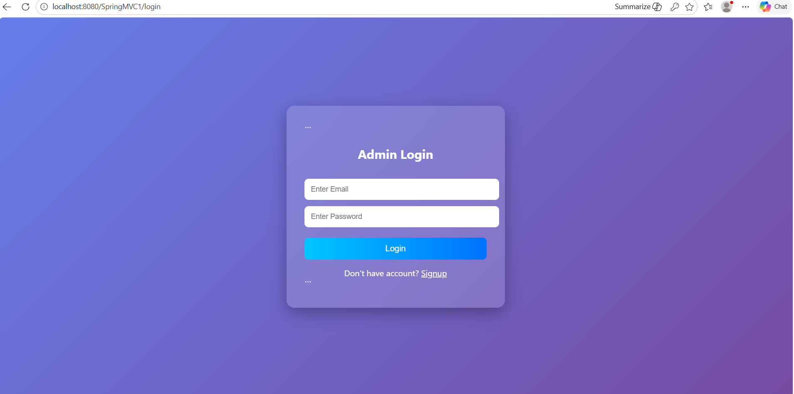
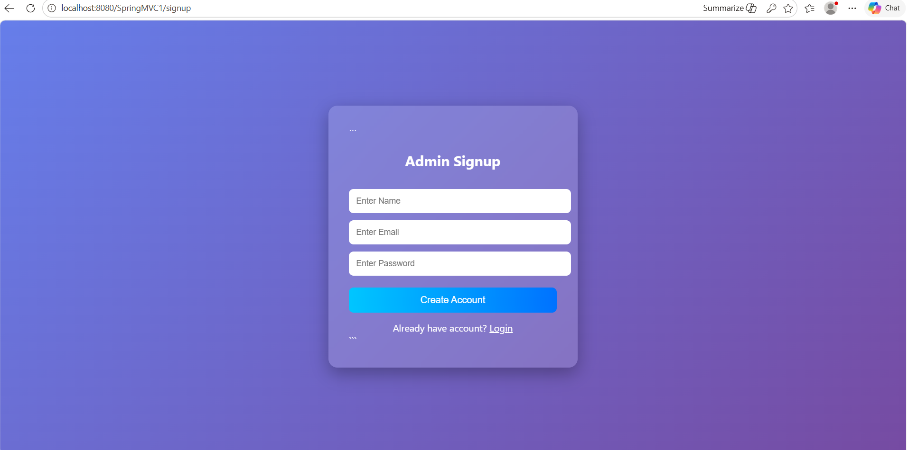
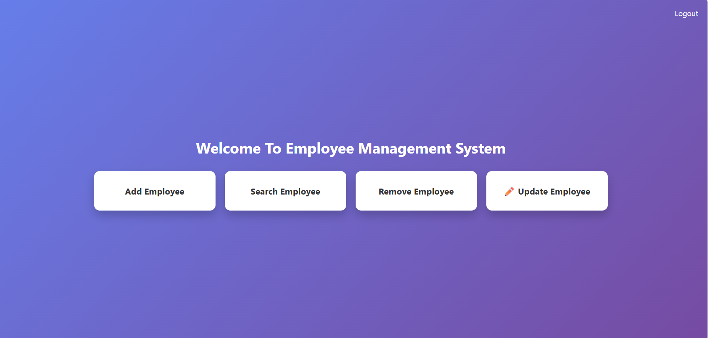
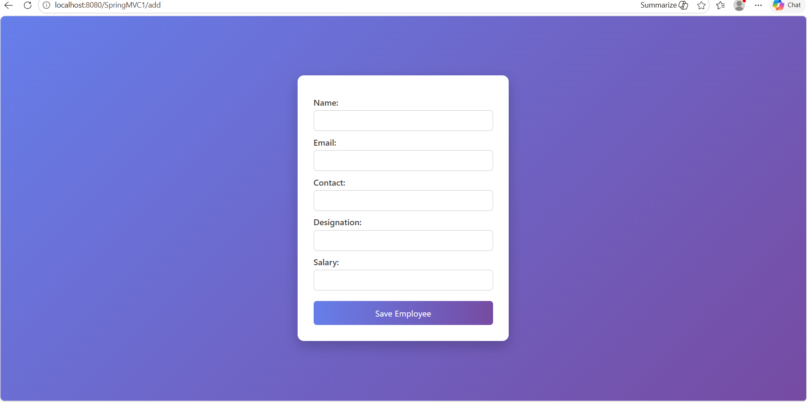
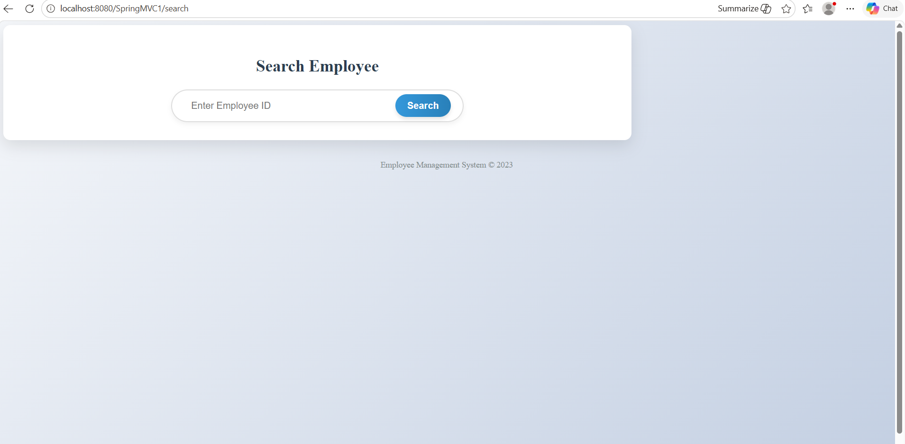
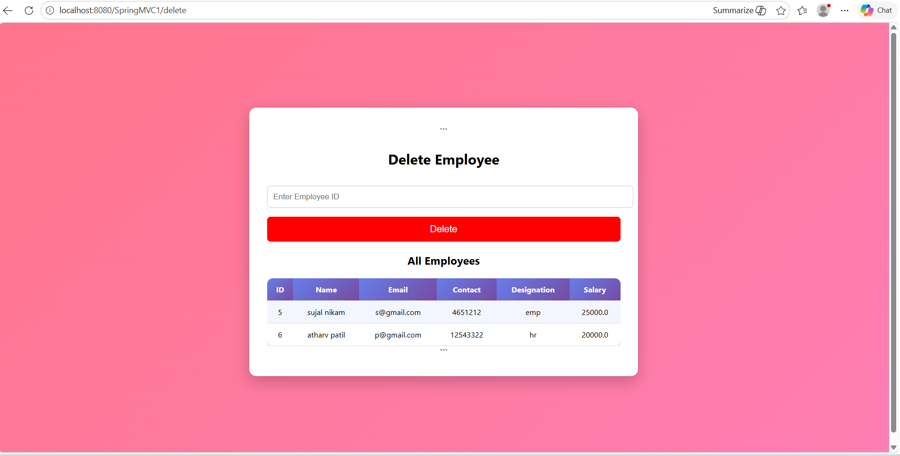
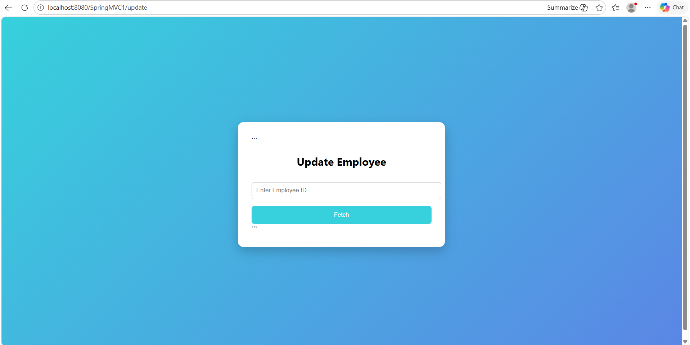

# 🚀 Employee Management System (Spring MVC)

A full-stack web application to manage employee records with complete CRUD functionality and Admin Authentication.

---

## 📌 Features

- ✅ Add Employee  
- 🔍 Search Employee  
- ❌ Delete Employee  
- ✏️ Update Employee  
- 🔐 Admin Login & Signup  
- 📋 View All Employees  

---

## 🛠️ Tech Stack

- **Backend:** Java, Spring MVC  
- **ORM:** Hibernate (JPA)  
- **Frontend:** JSP, HTML, CSS  
- **Database:** MySQL  
- **Server:** Apache Tomcat  

---
## 📸 Screenshots

### Login Page

### Sign Up Page

### 🏠 Home Page

### ➕ Add Employee

### 🔍 Search Employee

### ❌ Delete Employee

### ✏️ Update Employee

###
